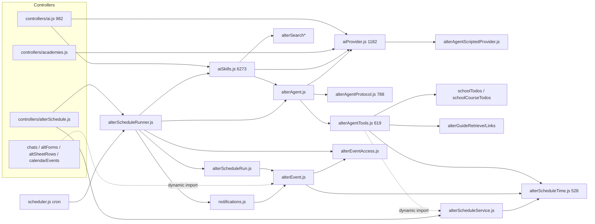

# Alter architecture audit (read-only)

- Repo: `bmrdevteam/Altsis` @ `81604f1` (`cursor/alter-event-trigger-fd17`, includes #419/#420/#421)
- Scope: backend `backend/src`, frontend `frontend/src`. Paths below are relative to those roots.
- Method: `wc -l`, `rg` import graph, targeted reads. No code was changed.

---

## 1. File map

### 1.1 Backend — agent core

| File | Lines | Responsibilities | Imported by |
|---|---:|---|---|
| services/alterAgent.js | 176 | Agent entry `executeAgentSkill`: provider/model resolve, PII mask of input/history/output, `generate()` closure, usage logging, toolNames extraction | aiSkills.js, alterScheduleRunner.js |
| services/alterAgentProtocol.js | 788 | Constants (MAX_AGENT_TOOL_STEPS=3), arg sanitizing, `wrapToolResult` (untrusted wrapper), fence parse (Gemini), promise-only detection, link stripping/bullet cleanup, **system prompt incl. tool-specific rules**, `runAgentLoop` for both native and fence | alterAgent.js |
| services/alterAgentTools.js | 619 | Todo projection helpers, eval-status labels, 4 tool defs (`get_my_todos`, `search_product_guide`, `manage_schedule`, `get_trigger_events`), conditional inclusion | alterAgent.js |
| services/alterAgentScriptedProvider.js | 250 | Demo/CI fake model keyed by API key sentinel `scripted-local-dev`; hard-codes tool names | aiProvider.js |
| services/aiProvider.js | 1182 | OpenAI/Anthropic/Gemini HTTP, content conversion, native tool schema conversion, streaming, model list, param-retry quirks, **scripted short-circuit** | refineAlterPrompt, alterAgent, aiChat, aiSkills, formAiChat, alterSearch, controllers/academies, controllers/ai |
| services/aiPromptPolicy.js | 1148 | FEATURE_PROFILES, AI_ERRORS, truncation, permission-authority helpers, prompt policy text | 18 modules (services + controllers + migration) |
| services/aiSafety.js | 61 | `maskSensitiveText/Object` | 9 modules |
| services/aiUsage.js / aiUsageQuota.js | 43 / 166 | Usage log; per-user quota | 7 modules each |

### 1.2 Backend — skills (non-agent)

| File | Lines | Responsibilities | Imported by |
|---|---:|---|---|
| services/aiSkills.js | **6273** | SKILL_IDS/CATALOG (13 ids), prompt-pack + prep settings, **`assertSeasonAiAccess`** (the only full AI access check), 10 skill executors (syllabus, evaluation, archive, document draft/review, form response, activity, form, assessment grade), parsers/normalizers per skill, `runAlterSkill` dispatcher (if-chain), regex `detectSkillFromMessage`, chat fallback | alterScheduleRunner, refineAlterPrompt, formAiChat, controllers/ai, aiChat, aiLibrary |
| services/alterSearch.js (+Sql/Pushdown/Peek/Agg/Catalog) | 495 (+193/309/195/126/1563) | NL→SQL data search skill | aiSkills.js |
| services/alterCorePrompt.js | 494 | Chat identity, safety text, how-to intent regexes, page-context builders | aiChat, aiSkills, refineAlterPrompt, formAiChat (**not** the agent) |
| services/alterGuideRetrieve.js / alterGuideLinks.js | 159 / 248 | Product-guide retrieval and deep links | aiSkills + alterAgentTools (both) |
| services/refineAlterPrompt.js | 215 | Prompt refinement | controllers/ai |
| services/formAiChat.js, aiChat.js | 883, 165 | Form/board chat (separate LLM paths) | controllers |
| services/alterConversations.js, alterAttachments.js | 570, 152 | Conversation persistence; attachments | controllers/ai, alterScheduleRunner |

### 1.3 Backend — schedules and events (runners)

| File | Lines | Responsibilities | Imported by |
|---|---:|---|---|
| services/alterScheduleTime.js | 528 | Limits/constants, error factory, TZ wall-clock math, next-run, min-interval, **write-intent guard**, input + event-spec normalization, identity key, **stripMarkdown**, claim query, slot key, **truncateSummary**, run state machine, skip reason mapping | alterScheduleRun, alterAgentTools, alterEventAccess, alterEvent, alterScheduleService |
| services/alterScheduleService.js | 445 | CRUD, `assertScheduleTeacher`, confirm/proposalKey, `listSchedulesForTool` | alterAgentTools (dynamic), controllers/alterSchedule, alterScheduleRunner |
| services/alterScheduleRun.js | 206 | One run: limits, **prompt suffix injection**, agent call, persist, notify | alterScheduleRunner |
| services/alterScheduleRunner.js | 181 | Wiring: Redis slot, claim, context load (`assertSeasonAiAccess`), agent, notifications | scheduler.js, controllers/alterSchedule |
| services/alterEvent.js | 227 | AsyncLocalStorage loop flag, block lists, enqueue/emit, inline teacher check | 5 controllers + notifications.js + alterScheduleRun |
| services/alterEventAccess.js | 185 | Re-check visibility per event type, DM excerpts, deleted-row fallback | alterEvent, alterScheduleRunner |
| controllers/alterSchedule.js | 136 | HTTP for schedules | routes |
| models/AlterSchedule.js | 117 | Schema | services |

### 1.4 Frontend

| File | Lines | Responsibilities |
|---|---:|---|
| layout/navbar/AlterPanel.tsx | **4045** | Chat UI, conversation list, SSE fetch+parse (≈1473–1525, 1938), skill draft rendering, schedule proposal card + confirm (1264, 3642–3670), attachments |
| hooks/useAPIv2.ts | **6234** | All API calls for the whole app (Alter is a slice) |
| alterUi/SkillDraftResult.tsx, SkillPrepDock.tsx, draftUi.ts | 1106, 1006, 594 | Per-skill draft UIs |
| pages/settings/tab/RoutineSettings.tsx | 666 | Routine CRUD UI, `EVENT_OPTIONS` (:56) |
| utils/alterScheduleLabel.ts | 65 | Routine labels, event-type labels (:37) |
| pages/admin/schools/tab/AISettings/Index.tsx | 719 | School AI settings |
| pages/owner/academies/tab/AISettings/Index.tsx | 816 | Academy AI settings incl. event flag |
| contexts/alterContext.tsx, utils/alterChatSnapshot.ts | 399, 627 | Page context snapshot for Alter |

### 1.5 Dependency sketch (current)

Notable: `aiSkills → alterAgent` (agent is a *skill*), `alterScheduleRunner → aiSkills` (only for the access check), `notifications → alterEvent` (generic infra depends on Alter), `aiProvider → scripted provider` (prod adapter depends on test double).

---

## 2. Findings

### F1. `aiSkills.js` is a 6273-line god file and also owns the AI access gate
- 38 exports: catalog (:160–258), prompt packs (:406, :512), `assertSeasonAiAccess` (:968–1067), 10 skill executors (:1319 … :5349), `runAlterSkill` if-chain (:5753–~6180), regex router (:6182).
- Runners import the whole module just for access (alterScheduleRunner.js:51). Any skill edit risks the schedule runner.

### F2. Tool schema is declared twice per tool and has already drifted
- Each tool has a free-text `arguments` string (fence/Gemini) and a JSON-Schema `parameters` (native).
- `manage_schedule`: `arguments` (alterAgentTools.js:354) has no `trigger`/`event`/`timezone`, but `parameters` (:366–386) does. Gemini academies cannot propose event routines; nobody would notice.

### F3. Tool-specific rules live in the generic loop prompt
- `buildAgentSystemPrompt` hard-codes tool names and domain rules: alterAgentProtocol.js:459–460 (`hasScheduleTool`/`hasTriggerTool` by name), :494–498 (todo/guide rules, `source=board`, `emptyCourses`), :500–506.
- The schedule run also injects tool-specific prompt text: alterScheduleRun.js:87. At `81604f1` this is a one-line `get_trigger_events` hint, not an `<event_data>` body dump.
- The scripted provider matches tool names again (alterAgentScriptedProvider.js:171–174, :190, :213, :234).
- Adding a tool means editing 3–4 files outside the tool.

### F4. Permission checks are split across three or more divergent implementations
- **Full check** `assertSeasonAiAccess` (aiSkills.js:968): academy aiEnabled, plan, key, season AI, school AI, role, exceptions, quota.
- **Weaker** `isScheduleTeacher` (alterScheduleService.js:26) and `assertScheduleTeacher` (:29–55): registration role only. A teacher can create a routine while AI is disabled; it then only fails at run time as a skip (alterScheduleRunner.js:48–61, `loadScheduleRunContext`).
- **Third copy**, an inline teacher lambda: alterEvent.js:193.
- **Fourth copy**, inline re-implementation in controllers/ai.js:693–735 (`generateGuidelinesTemplate`).
- Role is computed inline 3× in aiSkills (:1039, :2380, :6032).

### F5. Untrusted-data handling and PII masking are per-tool, not in the loop
- `get_my_todos` and `search_product_guide` call `maskSensitiveObject` (alterAgentTools.js:523, :586).
- `get_trigger_events` does not (:609–614), yet it carries DM excerpts (alterEventAccess.js:151).
- The loop wraps results as untrusted (alterAgentProtocol.js:88–97) but never masks; masking only happens on model output (alterAgent.js:116).
- "Data, not instructions" text is copy-pasted in 4 places: alterAgentProtocol.js:492, :505; alterScheduleRun.js:87; aiSkills.js:5530/:5589.

### F6. Provider layer mixes transport, quirks and the test double
- aiProvider.js (1182) is a good single choke point for HTTP, but it imports the scripted provider and short-circuits on an API-key sentinel (aiProvider.js:17–19, :1113–1121, :1147–1156; alterAgentScriptedProvider.js:12, :45).
- Native vs fence tool protocols both live in alterAgentProtocol.js (`parseAgentAction` :339, `runAgentLoop` :533) instead of behind a provider capability.
- `generateText` is called directly from 9 call sites: controllers/ai.js:750/764/854/892, aiChat.js:86, alterSearch.js:253, refineAlterPrompt.js:176, formAiChat.js:569, aiSkills.js:1264/1288/6135. Each site redoes usage logging and error mapping.

### F7. Domain and infra code depend on Alter (leaky coupling)
- `services/notifications.js:15,169` imports `emitAlterEvent`: generic notification infra knows Alter.
- Five controllers dynamically import Alter inline: chats.js:871, altForms.js:321/897, altSheetRows.js:1058, calendarEvents.js:131.
- `alterEventAccess.js` reaches into many domain models directly (e.g. ChatMessage at :72).
- `controllers/academies.js:857–876` mixes owner/admin flag rules in the controller.

### F8. Inconsistent error contracts
- Four styles coexist:
  - services throw `Error` with `status`/`code` (aiSkills.js:969–1063)
  - `scheduleError()` factory (alterScheduleTime.js:42)
  - tools return `{summary, error}` objects and never throw (alterAgentTools.js:414, :534, :594)
  - runners tag `err.skip = true` (alterScheduleRunner.js:48, :61)
- HTTP shapes differ:
  - controllers/ai.js:230–357 send `{message: err.message}`
  - controllers/alterSchedule.js:22–23 send `{message, code}`
  - SSE `error` sends `{message, conversationId}`
- Observed symptom: demo search leaked the raw internal message "SQL이 비어 있습니다".

### F9. Skills and agent tools overlap, and the hierarchy is inverted
- The agent is one of 13 skills (`SKILL_IDS.AGENT`, aiSkills.js:249, :5953). Skills cannot be called by the agent.
- Routing is a regex (`detectSkillFromMessage`, aiSkills.js:6182), parallel to model tool selection.
- Product-guide retrieval is wired twice: aiSkills (chat) and `search_product_guide` (alterAgentTools.js:539). Both import alterGuideRetrieve/alterGuideLinks.
- Two system-prompt builders with different safety text:
  - `buildAlterChatSystemPrompt`/`withAlterSafety` (alterCorePrompt.js:387, :410)
  - `buildAgentSystemPrompt` (alterAgentProtocol.js:452)
- No discrete "credit regulation" or "screen summary" capability exists: regulations come via library/guide retrieval, and screen context is a `pageNote` string (alterAgent.js:45, alterAgentProtocol.js:483).

### F10. `alterScheduleTime.js` (528) and `alterAgentProtocol.js` (788) bundle unrelated concerns
- alterScheduleTime mixes:
  - TZ math (:51–192)
  - prompt write-guard (:203)
  - event spec (:253)
  - identity key (:322)
  - markdown strip (:356)
  - claim (:367–394)
  - summary truncation (:395)
  - run state machine (:415)
- alterAgentProtocol mixes:
  - parsing (:339)
  - link sanitation (:159–327)
  - prompt (:452)
  - loop (:533)
- Markdown/link cleanup exists twice with different rules: alterScheduleTime.js:356 and alterAgentProtocol.js:225–327.

### F11. Event and limit constants are duplicated FE/BE
- `EVENT_TYPES` appears in:
  - backend alterScheduleTime.js:18
  - frontend RoutineSettings.tsx:56 (`EVENT_OPTIONS`)
  - frontend alterScheduleLabel.ts:37 (labels)
- Debounce choices, max routines and limits are also hard-coded in the UI.
- There are two AISettings pages (admin/schools 719, owner/academies 816).

### F12. Frontend god files
- AlterPanel.tsx (4045) does SSE parsing by hand (:1473–1525, :1938), plus conversation state, skill drafts, and the proposal card (:3642). A generic "confirm card" for future write tools would be bolted onto this file.
- useAPIv2.ts (6234) holds every API in the app.

### F13. Pre-existing security gap (outside Alter, affects Alter notifications)
- The `/io/notification` socket joins any `academyId/userId` room on client request without auth (utils/webSocket.js:26–30). Alter run summaries go to that room.

### F14. Tests exist but no eval harness
- 19 Alter/AI test files in backend/tests/services (`alter*` and `ai*`: alterAgent, alterSchedule, alterEvent, scripted provider, aiProvider, …). There is no separate scenario eval. The earlier “28 unit tests” count does not match this tree.
- No scenario-level eval. Behavior regressions seen in soak/demo were only caught manually:
  - first-phrasing `scheduleProposal: null`
  - propose near limit
  - search error leakage
- No dependency rules: no eslint boundary rules, no dependency-cruiser. `zod` is not a dependency.

---

## 3. Top 8 (for summary)
1. F1: aiSkills.js god file + access gate (aiSkills.js:968, :5753)
2. F2: dual tool schema drift (alterAgentTools.js:354 vs :366–386)
3. F3: tool rules leak into loop/runner/scripted (alterAgentProtocol.js:459–506, alterScheduleRun.js:87, alterAgentScriptedProvider.js:171)
4. F4: four permission checks (aiSkills.js:968, alterScheduleService.js:29, alterEvent.js:193, controllers/ai.js:693)
5. F5: masking per-tool; trigger events unmasked (alterAgentTools.js:609 vs :523; alterEventAccess.js:151)
6. F6: provider imports scripted double; 9 direct generateText sites (aiProvider.js:17, :1113)
7. F7: notifications/controllers → Alter coupling (notifications.js:15, :169; chats.js:871 etc.)
8. F8: four error styles, three HTTP error shapes (alterScheduleTime.js:42, alterScheduleRunner.js:48, controllers/ai.js:230 vs controllers/alterSchedule.js:22)
