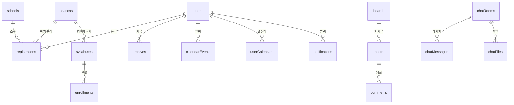

# 데이터베이스 설계

Altsis의 MongoDB 멀티 데이터베이스 아키텍처, 컬렉션 설계, Redis 활용, 그리고 데이터 암호화 전략을 설명합니다.

---

## 왜 MongoDB인가?

Altsis는 학교마다 서로 다른 양식(강의계획서, 평가, 기록, 출력 등)을 자유롭게 커스터마이징할 수 있는 **맞춤형 시스템**입니다. 이를 위해서는 정형화된 테이블 구조가 아니라 **유연한 객체(Object) 형태**로 데이터를 저장할 수 있어야 합니다.

| 요구사항 | MongoDB의 장점 |
|----------|----------------|
| 양식 구조가 학교마다 다름 | 스키마리스(Schemaless) 특성으로 유연한 객체 저장 |
| 학기별로 양식이 변경될 수 있음 | 동적 필드 추가/변경에 관계형 DB보다 유리 |
| 평가 데이터의 형식이 다양함 | 중첩 객체(Nested Object) 자연스럽게 지원 |
| 아카데미별 완전한 데이터 격리 필요 | 멀티 데이터베이스 아키텍처 용이 |

---

## 멀티 데이터베이스 아키텍처

Altsis는 **루트 DB**와 **아카데미별 독립 DB**로 구성된 멀티 데이터베이스 아키텍처를 사용합니다.

### 전체 구조

```
MongoDB Atlas 클러스터
│
├── root                    # 루트 데이터베이스
│   ├── academies           #   아카데미 목록 및 설정
│   └── users               #   시스템 소유자(owner) 계정
│
├── {academyId-A}-db        # 아카데미 A 전용 데이터베이스
│   ├── users               #   아카데미 A의 사용자
│   ├── schools             #   아카데미 A의 학교
│   ├── seasons             #   아카데미 A의 학기
│   └── ...                 #   (기타 모든 컬렉션)
│
├── {academyId-B}-db        # 아카데미 B 전용 데이터베이스
│   ├── users               #   아카데미 B의 사용자
│   ├── schools             #   아카데미 B의 학교
│   └── ...                 #   (완전히 독립된 데이터)
│
└── ...                     # 아카데미 수만큼 DB가 생성됨
```

### 연결 관리

서버가 시작되면 루트 DB에서 전체 아카데미 목록을 조회한 뒤, 각 아카데미의 DB에 대해 Mongoose 연결을 생성합니다.

```javascript
// backend/src/_database/mongodb/index.js (개념 코드)

// 1. 루트 DB 연결 (항상 존재)
const root = mongoose.createConnection(`${DB_URL}/root`);

// 2. 아카데미별 DB 연결 (동적 생성)
const conn = { root };
Academy.find({}, (err, academies) => {
  academies.forEach((academy) => {
    conn[academy.academyId] = mongoose.createConnection(
      `${DB_URL}/${academy.dbName}`
    );
  });
});
```

> [!IMPORTANT]
> 아카데미가 새로 생성되면 `addConnection()`으로 런타임에 동적으로 DB 연결이 추가됩니다. 아카데미가 삭제되면 `deleteConnection()`으로 DB가 드롭되고 연결이 제거됩니다.

### 모델 팩토리 패턴

아카데미별로 독립된 DB를 사용하므로, 모델 생성 시 아카데미 ID를 기반으로 해당 DB 연결에서 모델을 가져옵니다.

```javascript
// 모델 함수가 academyId를 받아 해당 DB의 모델을 반환
export const User = (academyId) => conn[academyId].model("User", userSchema);

// 컨트롤러에서 사용 예시
const users = await User(req.user.academyId).find({});
```

---

## 루트 데이터베이스 (root)

루트 데이터베이스는 시스템 전체를 관리하는 최상위 데이터베이스입니다.

### academies 컬렉션

아카데미의 기본 정보와 설정을 저장합니다.

| 필드 | 타입 | 설명 |
|------|------|------|
| `academyId` | String | 아카데미 고유 ID (유니크) |
| `academyName` | String | 아카데미 이름 |
| `email` | String | 관리자 이메일 |
| `tel` | String | 연락처 |
| `adminId` | String | 관리자 사용자 ID |
| `adminName` | String | 관리자 이름 |
| `dbName` | String | 아카데미 DB명 (`{academyId}-db`, 비공개) |
| `isActivated` | Boolean | 활성화 상태 (기본값: `true`) |
| `chatEnabled` | Boolean | 채팅 기능 활성화 (기본값: `false`) |
| `aiEnabled` | Boolean | AI 기능 활성화 (기본값: `false`) |
| `aiApiKey` | String | AI API 키 (비공개) |
| `aiModel` | String | AI 모델 (기본값: `gemini-3.6-flash`) |

> [!NOTE]
> `dbName`과 `aiApiKey` 필드는 `select: false`로 설정되어 일반 API 조회 시 반환되지 않습니다.

### users 컬렉션 (루트)

시스템 소유자(owner) 계정을 저장합니다. 아카데미별 사용자와는 별도의 컬렉션입니다.

---

## 아카데미 데이터베이스 ({academyId}-db)

각 아카데미는 독립된 데이터베이스를 가지며, 아래의 컬렉션으로 구성됩니다.

### 컬렉션 전체 목록



### 핵심 컬렉션 상세

#### users (사용자)

아카데미에 소속된 관리자, 매니저, 일반 멤버 계정을 저장합니다.

| 필드 | 설명 |
|------|------|
| `userId` | 사용자 로그인 ID |
| `userName` | 사용자 이름 |
| `password` | bcrypt 해시 비밀번호 |
| `auth` | 역할 (`admin`, `manager`, `member`) |
| `email` | 이메일 (Google OAuth 연동) |
| `profile` | 프로필 사진 URL |
| `snsId` | Google OAuth 연동 시 소셜 ID |

#### schools (학교)

아카데미 내의 학교 정보와 기록 양식 설정을 저장합니다.

| 필드 | 설명 |
|------|------|
| `schoolId` | 학교 고유 ID |
| `schoolName` | 학교 이름 |
| `formArchive` | 기록 양식 설정 (양식 ID, 레이블 등) |

#### seasons (학기)

학기 정보를 저장하며, 각 학기에는 권한 설정, 양식, 교과목, 강의실 정보가 포함됩니다.

| 필드 | 설명 |
|------|------|
| `school` | 소속 학교 참조 |
| `year` | 학년도 |
| `term` | 학기 |
| `period` | 학기 기간 (시작일~종료일) |
| `permissions` | 권한 설정 (수업 개설, 수강신청 등) |
| `formTimetable` | 시간표 양식 |
| `formSyllabus` | 강의계획서 양식 |
| `formEvaluation` | 평가 양식 |
| `subjects` | 교과목 목록 |
| `classrooms` | 강의실 목록 |

#### registrations (등록)

사용자와 학교, 학기를 연결하는 등록 정보입니다. 사용자가 특정 학교의 특정 학기에 참여하기 위한 레코드입니다.

| 필드 | 설명 |
|------|------|
| `user` | 사용자 참조 |
| `school` | 학교 참조 |
| `season` | 학기 참조 |
| `role` | 역할 (`teacher`, `student`) |
| `year` | 학년도 (예: "2024학년도") |
| `term` | 학기명 |

#### syllabuses (강의계획서)

수업의 강의계획서를 저장합니다. 양식 에디터로 정의된 구조에 따라 유연한 데이터를 포함합니다.

| 필드 | 설명 |
|------|------|
| `season` | 학기 참조 |
| `user` | 개설자 참조 |
| `classTitle` | 수업명 |
| `data` | 강의계획서 데이터 (양식에 따라 구조 상이) |
| `time` | 시간표 정보 |

#### enrollments (수강 정보)

학생의 수강 정보와 평가 데이터를 저장합니다.

| 필드 | 설명 |
|------|------|
| `syllabus` | 강의계획서 참조 |
| `student` | 수강 학생 참조 |
| `evaluation` | 평가 데이터 (**암호화 저장**) |

> [!WARNING]
> `evaluation` 필드는 `mongoose-encryption` 플러그인으로 암호화되어 저장됩니다. 복호화에는 `ENCKEY_E`와 `SIGKEY` 환경 변수가 필요합니다.

#### archives (학생 기록)

학생의 누적 기록을 저장합니다. 양식 에디터로 정의된 구조에 따라 다양한 형태의 기록을 포함합니다.

| 필드 | 설명 |
|------|------|
| `user` | 학생 참조 |
| `school` | 학교 참조 |
| `data` | 기록 데이터 (**암호화 저장**) |

> [!WARNING]
> `data` 필드는 `mongoose-encryption` 플러그인으로 암호화되어 저장됩니다. 복호화에는 `ENCKEY_A`와 `SIGKEY` 환경 변수가 필요합니다.

#### forms (양식 템플릿)

학교에서 사용하는 각종 양식의 템플릿을 저장합니다.

| 양식 유형 | 설명 |
|-----------|------|
| `syllabus` | 강의계획서 양식 |
| `timetable` | 시간표 양식 |
| `evaluation` | 평가 양식 |
| `archive` | 기록 양식 |
| `print` | 출력 양식 |

### 커뮤니케이션 컬렉션

#### notifications (알림)

사용자에게 전달되는 시스템 알림을 저장합니다.

| 필드 | 설명 |
|------|------|
| `user` | 수신자 참조 |
| `type` | 알림 유형 |
| `message` | 알림 내용 |
| `isRead` | 읽음 상태 |
| `data` | 추가 데이터 (링크, 관련 객체 등) |

#### notificationSettings (알림 설정)

사용자별 알림 수신 설정을 저장합니다.

#### boards (보드)

보드 설정과 권한을 관리합니다.

#### posts (게시글)

보드에 작성된 게시글을 저장합니다.

#### comments (댓글)

게시글에 달린 댓글을 저장합니다.

### 캘린더 컬렉션

#### calendarEvents (캘린더 이벤트)

수동으로 생성한 이벤트와 수업/강의계획서/메모에서 동기화된 이벤트를 모두 저장합니다.

| 필드 | 설명 |
|------|------|
| `sourceType` | 이벤트 출처 (`manual`, `enrollment`, `syllabus`, `memo`) |
| `duration` | 총 일수 (다일 이벤트) |
| `sequence` | 현재 일차 (1부터 시작) |

#### userCalendars (개인 캘린더)

사용자의 개인 캘린더 설정을 저장합니다.

### 채팅 컬렉션

#### chatRooms (채팅방)

채팅방 정보를 저장합니다 (참여자, 방 이름 등).

#### chatMessages (채팅 메시지)

채팅 메시지 내역을 저장합니다.

#### chatFiles (채팅 파일)

채팅에서 공유된 파일 메타데이터를 저장합니다.

### 기타 컬렉션

#### reminders (리마인더)

사용자의 리마인더(할 일) 정보를 저장합니다.

#### themeSettings (테마 설정)

사용자별 커스텀 테마 설정을 저장합니다.

---

## Redis

Altsis는 Redis를 세 가지 용도로 활용합니다.

### 1. 세션 저장소

Express 세션 데이터를 Redis에 저장하여 서버 재시작 시에도 세션이 유지됩니다.

```javascript
// backend/src/app.js
store: new RedisStore({
  client: redisClient,
  ttl: 24 * 60 * 60,  // 세션 만료: 24시간
})
```

| 설정 | 값 | 설명 |
|------|-----|------|
| TTL | 24시간 | 세션 유효 기간 |
| `rolling` | `true` | 요청마다 세션 만료 시간 갱신 |
| `resave` | `false` | 변경되지 않은 세션은 재저장하지 않음 |
| `saveUninitialized` | `false` | 초기화되지 않은 세션은 저장하지 않음 |

### 2. 실시간 알림 소켓 관리

알림 수신 상태를 Redis에 저장하여 중복 알림을 방지합니다.

```
키 패턴: isReceivedNotifications/{academyId}/{userId}
```

### 3. 채팅 소켓 매핑

채팅 소켓 ID와 사용자 정보의 매핑을 Redis 해시에 저장합니다.

```
키: io/chat/sid-user
필드: {socketId} → 값: chat:{academyId}:{userId}
```

---

## 데이터 암호화

민감한 데이터는 `mongoose-encryption` 플러그인을 사용하여 AES-256-CBC 방식으로 암호화됩니다.

### 암호화 대상

| 컬렉션 | 암호화 필드 | 암호화 키 | 설명 |
|--------|------------|-----------|------|
| `enrollments` | `evaluation` | `ENCKEY_E` + `SIGKEY` | 학생 평가 데이터 |
| `archives` | `data` | `ENCKEY_A` + `SIGKEY` | 학생 기록 데이터 |

### 암호화 구조

```javascript
// 예시: Enrollment 모델
enrollmentSchema.plugin(encrypt, {
  encryptionKey: process.env["ENCKEY_E"],  // AES 암호화 키
  signingKey: process.env["SIGKEY"],        // HMAC 서명 키
  encryptedFields: ["evaluation"],          // 암호화할 필드
});
```

> [!CAUTION]
> `ENCKEY_E`, `ENCKEY_A`, `SIGKEY` 환경 변수를 분실하면 암호화된 데이터를 복구할 수 없습니다. 이 키들은 안전하게 백업하여 관리해야 합니다.

---

## 데이터 흐름 다이어그램

```
사용자 로그인 → 아카데미 선택 → 학교/학기 선택
                   │                  │
                   ▼                  ▼
              root DB에서         {academyId}-db에서
              아카데미 조회       사용자/학교/학기 조회
                                      │
                                      ▼
                              registration으로
                              사용자-학교-학기 연결 확인
                                      │
                        ┌─────────────┼─────────────┐
                        ▼             ▼             ▼
                    syllabuses   enrollments    archives
                   (강의계획서)    (수강 정보)    (학생 기록)
```

---

## 다음 단계

- [인증 및 권한](authentication.md) - 데이터베이스와 연동된 인증 및 권한 체계
- [시스템 개요](overview.md) - 전체 아키텍처로 돌아가기
